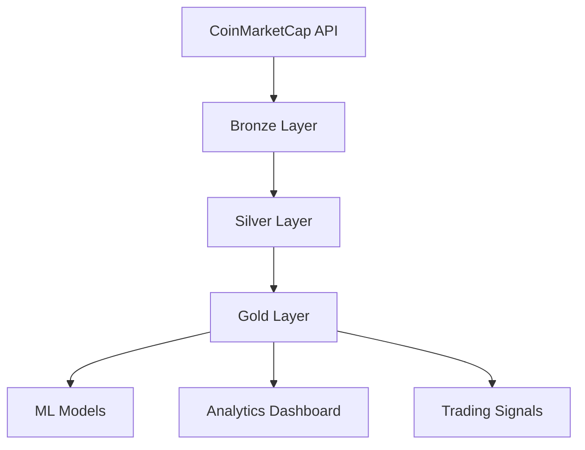

# CryptoSphere SQL Processing Architecture

## Overview

This directory contains the complete SQL database architecture for the CryptoSphere Analytics Platform, implementing a **Medallion Architecture** (Bronze → Silver → Gold) optimized for cryptocurrency analytics and machine learning.

## 🏗️ Architecture Components

### Database Platform
- **PostgreSQL 14+** with **TimescaleDB** extension
- Time-series optimized for high-frequency cryptocurrency data
- Automated data retention and compression policies
- Advanced indexing for analytical workloads

### Layer Structure

```
03-sql-processing/
├── 00-Schema-Setup/           # Database initialization
├── 01-bronze_layer/           # Raw data ingestion
├── 02-silver_layer/           # Cleaned & validated data  
└── 03-gold_layer/            # Business-ready analytics
```

## 📊 Data Flow Architecture



## 🥉 Bronze Layer (Raw Data)

**Purpose**: Store raw, unprocessed data from external APIs

### Tables
- `raw_crypto_listings` - Cryptocurrency metadata and information
- `raw_crypto_quotes` - Real-time price and market data
- `api_calls` - API usage tracking and rate limiting

### Key Features
- **Hypertables**: Time-series optimization with automatic partitioning
- **Data Lineage**: Full audit trail of all data ingestion
- **API Monitoring**: Rate limiting, error tracking, cost management
- **Retention Policy**: 6 months of detailed raw data

### Files
- `01-create_bronze_tables.sql` - Table definitions and hypertables
- `02-bronze_procedures.sql` - Data ingestion and validation procedures
- `03-bronze_views.sql` - Analysis views for raw data monitoring

## 🥈 Silver Layer (Clean Data)

**Purpose**: Cleaned, validated, and standardized data ready for analysis

### Tables
- `clean_crypto_listings` - Validated cryptocurrency information
- `clean_crypto_quotes` - Quality-assured price data
- `crypto_price_snapshots` - Pre-aggregated OHLCV data
- `data_quality_metrics` - Quality tracking and validation

### Key Features
- **Data Quality Scoring**: Automated quality assessment (0.0-1.0)
- **Outlier Detection**: Statistical anomaly identification
- **Historical Versioning**: Slowly changing dimensions support
- **Data Validation**: Comprehensive business rule enforcement
- **Retention Policy**: 2 years of cleaned data

### Files
- `01-create_silver_tables.sql` - Clean data table definitions
- `02-silver_etl_procedures.sql` - Bronze-to-Silver transformation logic

## 🥇 Gold Layer (Business Data)

**Purpose**: Business-ready data marts optimized for analytics and ML

### Data Marts
- `market_overview_daily` - Market aggregations and KPIs
- `crypto_performance_metrics` - Technical indicators and performance
- `trading_signals` - ML-generated trading recommendations
- `portfolio_analysis_metrics` - Portfolio tracking and risk analysis
- `correlation_matrix` - Cross-asset correlation analysis
- `ml_features_dataset` - Feature-engineered ML training data
- `business_kpis` - Executive dashboard metrics

### Key Features
- **Technical Indicators**: RSI, MACD, Bollinger Bands, Moving Averages
- **Risk Metrics**: VaR, Sharpe Ratio, Sortino Ratio, Drawdowns
- **ML Features**: 50+ engineered features for predictive modeling
- **Performance Analytics**: Returns, volatility, correlation analysis
- **Retention Policy**: 5 years of analytical data

### Files
- `01-create_gold_data_marts.sql` - Business data mart definitions
- `02-gold_etl_procedures.sql` - Silver-to-Gold transformation procedures

## 🔧 Setup Instructions

### 1. Database Prerequisites
```sql
-- Enable required extensions
CREATE EXTENSION IF NOT EXISTS timescaledb;
CREATE EXTENSION IF NOT EXISTS "uuid-ossp";
CREATE EXTENSION IF NOT EXISTS pg_stat_statements;
```

### 2. Schema Initialization
```sql
-- Run the setup scripts in order:
\i 00-Schema-Setup/01-initial_setup.sql
```

### 3. Layer Creation (In Order)
```sql
-- Bronze Layer
\i 01-bronze_layer/01-create_bronze_tables.sql
\i 01-bronze_layer/02-bronze_procedures.sql
\i 01-bronze_layer/03-bronze_views.sql

-- Silver Layer
\i 02-silver_layer/01-create_silver_tables.sql
\i 02-silver_layer/02-silver_etl_procedures.sql

-- Gold Layer
\i 03-gold_layer/01-create_gold_data_marts.sql
\i 03-gold_layer/02-gold_etl_procedures.sql
```

## 🚀 ETL Operations

### Daily ETL Pipeline
```sql
-- Complete daily pipeline execution
SELECT * FROM run_bronze_to_silver_etl();
SELECT * FROM run_gold_layer_etl();
```

### Manual Data Processing
```sql
-- Process specific cryptocurrency
SELECT * FROM process_crypto_quotes(NULL, 'BTC');

-- Generate technical indicators
SELECT * FROM generate_crypto_performance_metrics(CURRENT_DATE, 'ETH');

-- Update correlation matrix
SELECT * FROM generate_correlation_matrix(CURRENT_DATE, 30);
```

## 📈 Key Analytics Capabilities

### Market Analysis
- Real-time market overview and sentiment
- Top gainers/losers identification
- Market dominance tracking (BTC, ETH, Altcoins)
- Volume and volatility analysis

### Technical Analysis
- **Moving Averages**: SMA/EMA (7, 12, 26, 30, 90 days)
- **Momentum Indicators**: RSI, MACD, Price momentum
- **Volatility Bands**: Bollinger Bands with position tracking
- **Volume Analysis**: Volume ratios and strength indicators

### Risk Management
- **Portfolio Metrics**: Sharpe ratio, Sortino ratio, maximum drawdown
- **Correlation Analysis**: Cross-asset correlations with significance testing
- **Value-at-Risk**: 95% VaR calculations
- **Concentration Risk**: Portfolio diversification metrics

### Machine Learning Support
- **Feature Engineering**: 50+ technical and fundamental features
- **Target Variables**: Price direction, volatility classification
- **Data Quality**: Automated feature completeness scoring
- **Model Training**: Ready-to-use ML datasets with proper train/test splits

## 🔍 Data Quality Framework

### Quality Scoring System
- **Price Validation**: Null checks, positive values, extreme movement detection
- **Volume Validation**: Non-negative values, consistency checks
- **Timestamp Validation**: Freshness checks, sequence validation
- **Statistical Outliers**: IQR-based anomaly detection
- **Overall Score**: Weighted composite score (0.0-1.0)

### Quality Monitoring
```sql
-- Check data quality dashboard
SELECT * FROM v_data_quality_dashboard;

-- Monitor ETL job performance
SELECT * FROM etl_jobs 
WHERE end_time >= CURRENT_TIMESTAMP - INTERVAL '24 hours'
ORDER BY end_time DESC;
```

## 📊 Performance Optimization

### Indexing Strategy
- **Time-based Indexes**: Optimized for time-series queries
- **Symbol Indexes**: Fast cryptocurrency lookups
- **Composite Indexes**: Multi-column analytical queries
- **Partial Indexes**: Quality-filtered data access

### Hypertable Configuration
- **Chunk Intervals**: 1 day (quotes), 7 days (snapshots), 1 month (analytics)
- **Compression**: Automatic compression after 7 days
- **Retention**: Automated data lifecycle management
- **Continuous Aggregates**: Pre-computed analytics for performance

## 🛡️ Security & Compliance

### Access Control
```sql
-- Example role-based permissions
GRANT SELECT ON ALL TABLES IN SCHEMA bronze TO crypto_readonly;
GRANT SELECT, INSERT, UPDATE ON ALL TABLES IN SCHEMA silver TO crypto_readwrite;
```

### Data Lineage
- Full audit trail from API to analytics
- ETL batch tracking with unique identifiers
- Error logging and recovery procedures
- Data quality issue tracking

## 📝 Monitoring & Alerting

### Key Metrics to Monitor
- **Data Freshness**: Last update timestamps
- **Quality Scores**: Below-threshold quality alerts
- **ETL Performance**: Processing times and error rates
- **API Usage**: Rate limits and cost tracking
- **Storage Growth**: Partition sizes and retention compliance

### Sample Monitoring Queries
```sql
-- Data freshness check
SELECT 
    symbol,
    MAX(timestamp_utc) as last_update,
    EXTRACT(MINUTES FROM (CURRENT_TIMESTAMP - MAX(timestamp_utc))) as minutes_behind
FROM clean_crypto_quotes
GROUP BY symbol
HAVING MAX(timestamp_utc) < CURRENT_TIMESTAMP - INTERVAL '30 minutes';

-- Quality issues summary
SELECT 
    symbol,
    COUNT(*) as total_records,
    AVG(data_quality_score) as avg_quality,
    COUNT(*) FILTER (WHERE data_quality_score < 0.8) as poor_quality_count
FROM clean_crypto_quotes
WHERE timestamp_utc >= CURRENT_TIMESTAMP - INTERVAL '24 hours'
GROUP BY symbol
ORDER BY avg_quality ASC;
```

## 🔄 Backup & Recovery

### Recommended Backup Strategy
- **Full Backups**: Weekly full database backups
- **Incremental Backups**: Daily incremental backups
- **Point-in-Time Recovery**: WAL archiving for precise recovery
- **Cross-Region Replication**: For disaster recovery

### Data Export Capabilities
```sql
-- Export ML dataset
COPY (
    SELECT * FROM ml_features_dataset 
    WHERE feature_timestamp >= '2024-01-01'
) TO '/path/to/ml_training_data.csv' WITH CSV HEADER;

-- Export trading signals
COPY (
    SELECT * FROM trading_signals 
    WHERE signal_timestamp >= CURRENT_TIMESTAMP - INTERVAL '30 days'
    AND confidence_level >= 0.7
) TO '/path/to/trading_signals.csv' WITH CSV HEADER;
```

## 🤝 Integration Points

### API Integration
- **CoinMarketCap API**: Primary data source
- **Rate Limiting**: Built-in API usage management
- **Error Handling**: Retry logic and failure recovery

### ML Model Integration
- **Feature Store**: Standardized ML feature access
- **Model Training**: Direct database connectivity
- **Prediction Storage**: Trading signals persistence

### Analytics Integration
- **Business Intelligence**: Direct SQL access for BI tools
- **Real-time Analytics**: Streaming data support
- **Custom Reports**: Flexible query interface

## 📚 Additional Resources

### Performance Tuning
- Review query execution plans regularly
- Monitor hypertable chunk exclusion
- Optimize joins with proper indexing
- Use EXPLAIN ANALYZE for query optimization

### Scaling Considerations
- Horizontal scaling with TimescaleDB clustering
- Read replicas for analytical workloads
- Partitioning strategies for large datasets
- Connection pooling for high concurrency

---

*This SQL architecture provides a robust foundation for cryptocurrency analytics, supporting everything from real-time trading decisions to long-term market research and machine learning model development.*